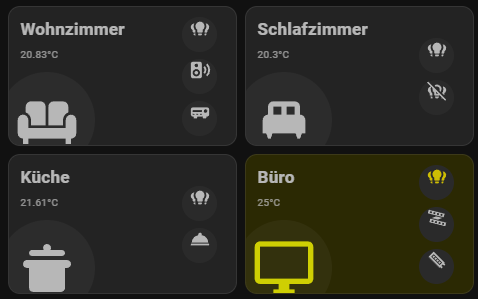
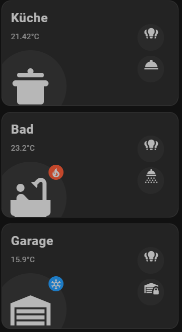

# 🌌 SpaceUnit Card

**Kompakte Custom Card für Home Assistant**

## ⚙️ Konfiguration

```yaml
type: custom:spaceunit-card
title: Wohnzimmer
icon: mdi:sofa
entity: light.wohnzimmerlicht_gr
entity_temp: sensor.0x00124b002a53a551_temperature
temp_min: 18
temp_max: 23
tap_action:
  action: navigate
  navigation_path: /mobile-great-hall
action_entities:
  - entity: light.wohnzimmerlicht_gr
    icon: mdi:lightbulb-group
    tap_action:
      action: toggle
  - entity: switch.wohnzimmer_audio_plug
    icon: mdi:speaker-wireless
  - entity: media_player.denon_avr_x1800h_2
    icon: mdi:audio-video

```

## Screenshots





## 🛠️ Installation (HACS)

1. Repository zu HACS hinzufügen: `https://github.com/dein-user/spaceunit`
2. Lovelace-Resource wird automatisch hinzugefügt:
   `/hacsfiles/spaceunit/spaceunit-card.js`
3. Danach: Dashboard → Karte manuell hinzufügen

